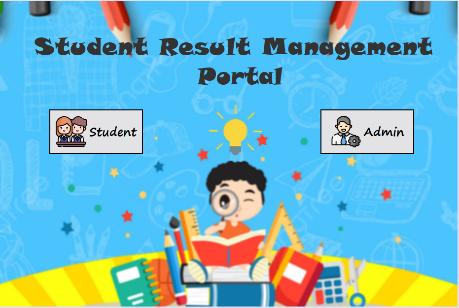
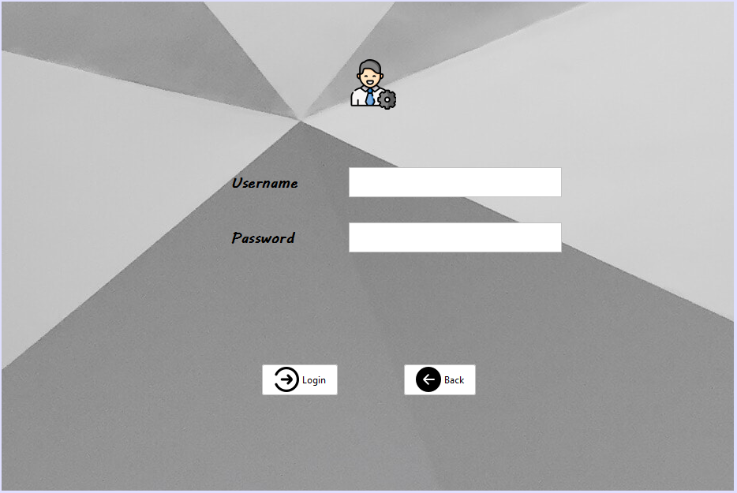
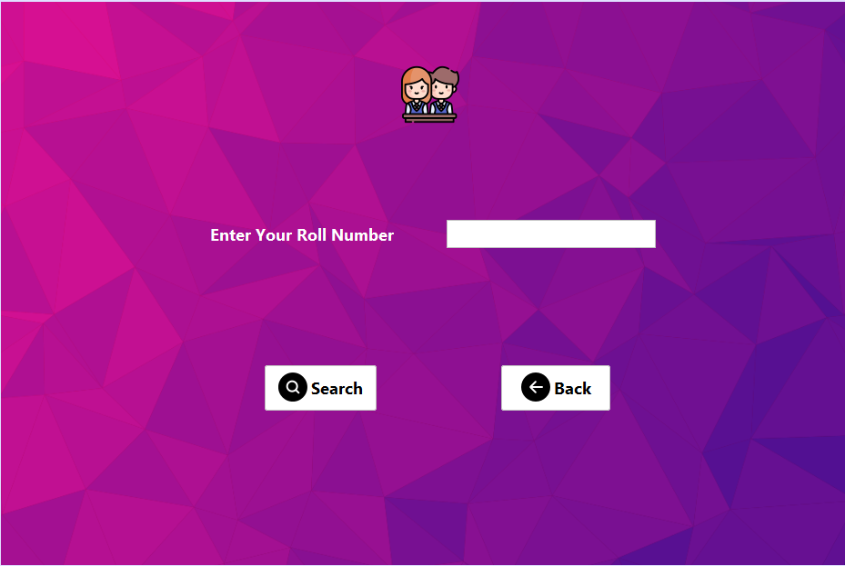

# Student-Result-Management-Portal 🏤
## ➡️ Introduction:
The Student Result Management System is a comprehensive software application designed to serve as a portal for displaying student results. This project allows teachers and administrators to manage student marks and generate reports on student performance. The system also includes a student interface where students can view their results.
## ➡️ Project Description:
## ➡️ Technologies Used:
1. Java
2. Java Swing and JFrame: Java Swing is a part of Java Foundation Classes (JFC) and serves as the primary framework for creating graphical user interfaces (GUIs) in Java. It offers a rich set of UI components and allows developers to build lightweight applications with ease. JFrame, a class within Java Swing, provides the main window or frame where GUI components are placed and coded.
3. MySQL Database
4. NetBeans IDE: NetBeans is an integrated development environment (IDE) that supports Java development. It provides a user-friendly interface and a range of tools for coding, debugging, and project management.
5. JDBC (Java Database Connectivity): JDBC is a Java API that enables Java applications to interact with relational databases like MySQL. It provides a set of classes and interfaces that allow developers to perform database operations, such as establishing a connection, executing SQL queries, and retrieving data. JDBC is used in the project to connect NetBeans IDE with the MySQL database for seamless data transfer and manipulation.
## ➡️ SCREENSHOTS
👉 Screenshot of Main Interface

👉 Screenshot of Admin Portal Interface

👉 Screenshot of Student Portal Interface

👉 Admin Panel Interface
👉 Result Display Interface
